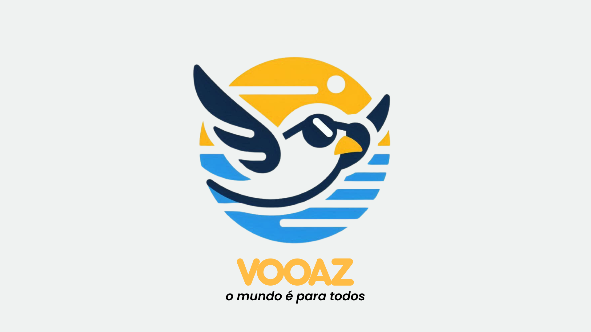

#  VOOAZ- O mundo é para todos 😎

 

<h2> 🎯 Objetivo:</h2>
   

     Nosso Objetivo, é criar um aplicativo voltado para pessoas com deficiência auditiva ou visual, que estão a procura de expandir seus horizontes. Buscamos tornar viagens mais acessíveis e inclusivas para esse público, através de guias especializados e uma comunidade interativa, voltada para a criação de relacionamentos entre usuários. Para tornar o projeto realidade, utilizamos a linguagem Kotlin, aplicada no Android studio, com Jackpack compos
   

- Acesso ao figma: [Figma VOOAZ](https://www.figma.com/design/pfqkjOupa5jYwPoLVXwLpS/VOOAZ-DEMODAY?node-id=0-1&t=sgmaTzIDFaJZiQ99-1)

 

<h2>🤝🏾 Equipe de desenvolvimento:</h2>

<table>
  <tr>
    <td align="center">
          <a href="https://github.com/heloomendess" title="Github Heloisa Mendes">
         
        
          <b>Heloisa Mendes</b>
        
      </a>
    </td>
    <td align="center">
     <a href="https://github.com/danalcantara" title="Github Danilo Alcantra">
         
        
          <b>Danilo Alcantra</b>
        
      </a>
    </td>
    <td align="center">
     <a href="https://github.com/cunhagustavo" title="Github Gustavo Cunha">
         
        
          <b>Gustavo Cunha</b>
        
      </a>
    </td>
     <td align="center">
     <a href="https://github.com/IurySven" title="Github Iury Sven">
         
        
          <b>Iury Sven</b>
        
      </a>
    </td>
     <td align="center">
      <a href="https://github.com/AmorimCelio" title="Github Célio Amorim">
         
        
          <b>Célio Amorim</b>
        
      </a>
    </td>
     <td align="center">
     <a href="https://github.com/KawanTurchiai" title="Github Kawan Turchiai">
         
        
          <b>Kawan Turchiai</b>
        
      </a>
     </td>
     <td align="center">
      <a href="https://github.com/Grazy-Cavalcante" title="Github Grazielly Oliveira">
         
        
          <b>Grazielly Oliveira</b>
        
      </a>
    </td>
     <td align="center">
      <a href="https://github.com/marianapa1va" title="Mariana Paiva">
         
        
          <b>Mariana Paiva</b>
           
      </a>
    </td>
  </tr>
</table>
 

## 📱 Siga-nos em nossas redes sociais:

Siga a VOOAZ nas redes sociais para ficar por dentro das últimas novidades e atualizações:

- Linkedin [Linkedin VOOAZ](https://www.linkedin.com/company/vooaz/posts/?feedView=all)
- Instagram: [vooaz_](https://www.instagram.com/vooaz_/)

